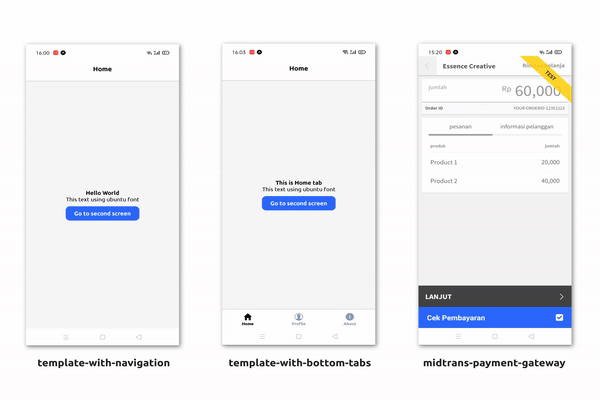

# React Native + Expo Starter Templates

These are my starter templates or my way for building mobile app with react native and expo. I'm tired everytime I create a new project from blank, so I decided to make a starter templates, feel free to use it 🥳

Bonus Snap Midtrans payment gateway😘

## Preview



**Firebase auth flow**


## Included

- Pre-loading and Caching Assets
- Example using Custom Fonts
- Layout Component safe area
- Top Navigation component

## Usage

1. Install [node.js](https://nodejs.org/en/)
2. Install Expo

   ```jsx
   npm install --global expo-cli
   ```

3. Download the template choose
4. Install deps on your template folder

   ```jsx
   npm install
   ```

5. Start the environtment

   ```jsx
   expo start
   ```

## Documentation

> Note: There are some custom components I made

### Typescript

- [Template bottom tabs with auth flow (Typescript)](https://github.com/codingki/react-native-expo-template/tree/master/template-typescript-bottom-tabs-with-auth-flow)

### Javascript

- [Template Blank with navigation](https://github.com/codingki/react-native-expo-template/tree/master/template-with-navigation)
- [Template Bottom tabs](https://github.com/codingki/react-native-expo-template/tree/master/template-with-bottom-tabs)
- [Template Firebase auth flow](https://github.com/codingki/react-native-expo-template/tree/master/template-with-firebase-auth-flow)
- [Template Bottom tabs with auth flow](https://github.com/codingki/react-native-expo-template/tree/master/template-with-bottom-tabs-auth-flow)
- [Midtrans Payment gateway example](https://github.com/codingki/react-native-expo-template/tree/master/midtrans-payment-gateway)

if you find these useful don't forget to give it a star ⭐ and share it to your friends ❤️

Reach me on [twitter](https://twitter.com/kikiding/)
