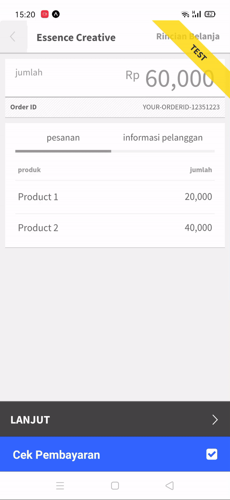

# Midtrans Payment gateway example

SNAP Midtrans payment gateway example on client side (this is not the best way to do this, better all the midtrans API processed on a cloud functions for better performance \*I think)

## Preview



## Problems

Unfortunately midtrans npm package not supported for Expo projects

## Solutions

I found the way to use snap midtrans payment gateway using their HTTP API, full docs [here](https://api-docs.midtrans.com/)

SNAP midtrans gives response a url for the payment gateway you can use `react-native-webview` or open the url on a browser, but I use react-native-webview for better UX 😛

## Package used

```jsx
"dependencies": {
    "base-64": "^1.0.0",
    "expo": "~39.0.2",
    "expo-status-bar": "~1.0.2",
    "react": "16.13.1",
    "react-dom": "16.13.1",
    "react-native": "https://github.com/expo/react-native/archive/sdk-39.0.4.tar.gz",
    "react-native-web": "~0.13.12",
    "react-native-webview": "10.7.0"
}
```

## Transactions

`midtrans()` to get the payment gateway url

- Get your midtrans server key [https://dashboard.sandbox.midtrans.com/settings/config_info](https://dashboard.sandbox.midtrans.com/settings/config_info)

  ```jsx
  // dont forget add ":" in the end of the string
  const serverKey = 'YOURSERVERKEY:';
  const base64Key = base64.encode(serverKey);
  ```

- API endpoint

  This endpoint using method `POST`

  **Sandbox url**

  ```jsx
  // Transactions url/payment gateway
  const transactionsUrl =
  	'https://app.sandbox.midtrans.com/snap/v1/transactions';
  ```

  **Production url**

  ```jsx
  // Transactions url/payment gateway
  const transactionsUrl = 'https://app.midtrans.com/snap/v1/transactions';
  ```

- Minimum transaction details (full read [here](https://snap-docs.midtrans.com/#request-body-json-parameter))

  ```jsx
  {
    "transaction_details": {
      "order_id": "ORDER-101",
      "gross_amount": 10000
    }
  }
  ```

- Response success

  ```jsx
  {
    "token":"66e4fa55-fdac-4ef9-91b5-733b97d1b862",
    "redirect_url":"https://app.sandbox.midtrans.com/snap/v2/vtweb/66e4fa55-fdac-4ef9-91b5-733b97d1b862"
  }
  ```

## Status

`getStatus()` to check status of the transaction

- Get your midtrans server key [https://dashboard.sandbox.midtrans.com/settings/config_info](https://dashboard.sandbox.midtrans.com/settings/config_info)

  ```jsx
  // dont forget add ":" in the end of the string
  const serverKey = 'YOURSERVERKEY:';
  const base64Key = base64.encode(serverKey);
  ```

- API endpoint

  This endpoint using method `GET`

  require an `id`

  **Sandbox url**

  ```jsx
  // Status url/check status of the transaction using an ID
  const statusUrl = `https://api.sandbox.midtrans.com/v2/${ID}/status`;
  ```

  **Production url**

  ```jsx
  // Status url/check status of the transaction using an ID
  const statusUrl = `https://app.midtrans.comv2/${ID}/status`;
  ```

- Response

  ```jsx
  // Example response
  {
    "status_code" : "200",
    "status_message" : "Success, transaction found",
    "transaction_id" : "249fc620-6017-4540-af7c-5a1c25788f46",
    "masked_card" : "481111-1114",
    "order_id" : "example-1424936368",
    "payment_type" : "credit_card",
    "transaction_time" : "2015-02-26 14:39:33",
    "transaction_status" : "capture",
    "fraud_status" : "accept",
    "approval_code" : "1424936374393",
    "signature_key" : "2802a264cb978fbc59f631c68d120cbda8dc853f5dfdc52301c615cf4f14e7a0b09aa...",
    "bank" : "bni",
    "gross_amount" : "30000.00",
    "channel_response_code": "00",
    "channel_response_message": "Approved",
    "card_type": "credit"
  }
  ```

- Transactions status see [here](https://api-docs.midtrans.com/#transaction-status)

if you find these useful don't forget to give it a star ⭐ and share it to your friends ❤️

Reach me on [twitter](https://twitter.com/kikiding/)
