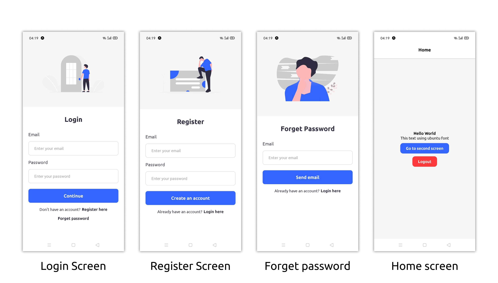

# Template Bottom tabs with auth flow

Template starter with React Navigation Bottom Tabs and Firebase auth using React Context

# Preview



# Installation

1. Install [node.js](https://nodejs.org/en/)
2. Install Expo

   ```jsx
   npm install --global expo-cli
   ```

3. Download this repo
4. Install deps on your template folder

   ```jsx
   npm install
   ```

5. Start the environtment

   ```jsx
   expo start
   ```

# Auth Flow

### Firebase Setup

- Set up a new firebase project
- Go to Authentication and under Sign-in Method enable Email/Password
- Fill this firebase config to your config inside `./src/navigation/AppNavigator.js`

```jsx
// Better put your these secret keys in .env file
const firebaseConfig = {
	apiKey: '',
	authDomain: '',
	databaseURL: '',
	projectId: '',
	storageBucket: '',
	messagingSenderId: '',
	appId: '',
};
```

and you good to go!

### Prebuilt UI Screens

There are 3 screens included inside `./src/screens/auth` and one more thing its included with the firebase auth function, so you don't need to create the function. The ilustrations I use [undraw](https://undraw.co/)

- Login screen `./src/screens/auth/login.tsx`
- Register screen `./src/screens/auth/register.tsx`
- Forget password screen `./src/screens/auth/forget.tsx`

I personally use these screens on my project [TiktTeng](https://github.com/codingki/TikTeng) in early stages before the redesign, feel free to use these screens ❤️

### React Navigation Auth Flow

The checking logged users process is inside `./src/provider/AuthProvider` I use React Context, you can add more functions like get the data of the user and store it to the context (better static data, ex: uid)

Inside the navigator `./src/navigation/AppNavigator.js`
There's 2 stack navigator :

- `<Auth/>` → for not logged in users stack
- `<Main/>` → for logged in users stack
- `<Loading/>` → when checking if the user is logged in or not loading screen

```jsx
export default () => {
	const auth = useContext(AuthContext);
	const user = auth.user;
	return (
		<NavigationContainer>
			{user == null && <Loading />}
			{user == false && <Auth />}
			{user == true && <Main />}
		</NavigationContainer>
	);
};
```

# Rapi UI


These UI components are provided by [Rapi UI](https://rapi-ui.kikiding.space/).
Check the [documentation](https://rapi-ui.kikiding.space/docs/) for usage and more components.

# File Managements

These are the folders and the functionality

```jsx
/src/assets -> for media such as images, etc
/src/components -> for components
/src/navigation -> for React Navigation
/src/provider -> for React Context
/src/screens -> for Screens
```

if you find these useful don't forget to give it a star ⭐ and share it to your friends ❤️

Reach me on [twitter](https://twitter.com/kikiding/)
